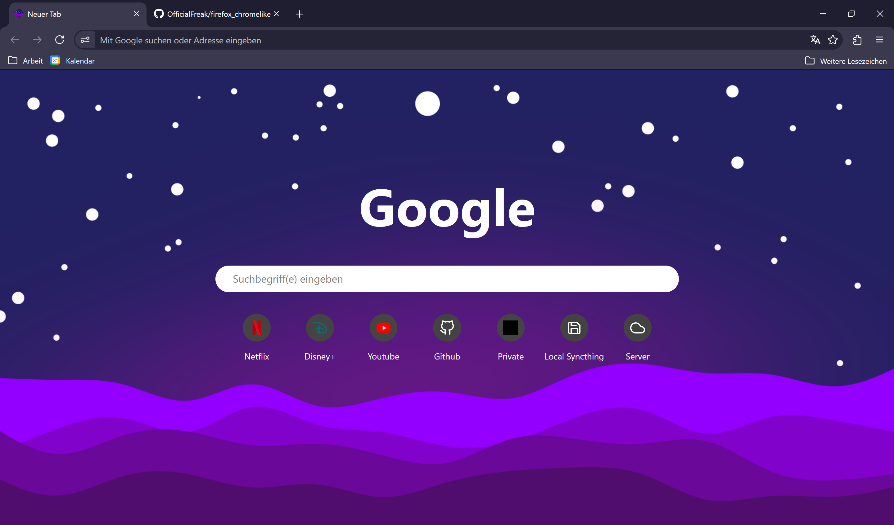

# Firefox Chrome-like Skin

To get this theme, look up how to activate `userChrome.css` and then use the file from this repository.

Also included is my Tabliss (New Tab) Setup which you can get by installing the Tabliss Extension and pasting the CSS from `tabliss.css` inside of the Custom CSS Widget. The Wallpaper can be set manually and is included as well.